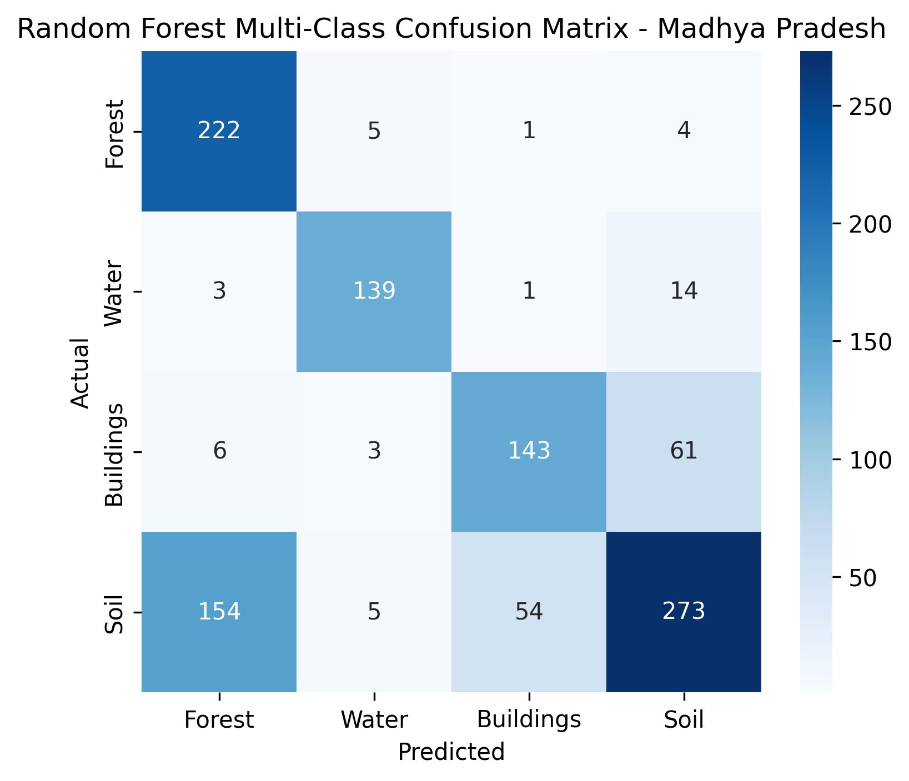

# Executive summary

Bare dry soil is classified as buildings, and it is the single largest error in every model this project has built.
The root cause is physical, not algorithmic: bright dry soil and concrete have near-identical Sentinel-2 reflectance, and no per-pixel optical feature separates them.
The project already attacked this correctly with texture and radar, lifting Soil recall from 7% to 54% and overall accuracy to 73.9%.
The ceiling that remains is set by data and class definitions, not by the classifier, and the research below supports five conclusions:

1. **Label the missing terrain.**
No bright arid or rocky soil exists in the training set, and the worst failures (Thar at 80.9% Buildings, the Chambal ravines, the Malwa black cotton soil) are exactly the unrepresented terrain.
Collecting a few hundred labels in western Madhya Pradesh is the highest-leverage single action available, and it is the only fix that addresses the cause rather than the symptom.
2. **Stop force-classifying unknown pixels.**
The cheapest high-yield code change is a reject option: emit per-class probabilities, threshold the maximum, and mark low-confidence pixels unknown instead of guessing.
The Soil vs Buildings tie is precisely a low-confidence decision, and this turns the largest confusion cell into a flagged band.
3. **Add a building-footprint prior.**
Google Open Buildings V3 covers India natively in Earth Engine and is decorrelated from reflectance, so it carries geometric evidence the spectral stack cannot see.
Rasterised as a built-fraction band it is the strongest single new feature identified in this study.
4. **Fix the SAR compositing before adding anything else.**
The current median mixes ascending and descending orbits and un-normalised incidence angles (29 to 46 degrees), which blurs several dB of class separation.
Orbit-consistent compositing, incidence-angle normalisation and temporal standard deviation are cheap, stay in Earth Engine, and directly attack the arid-tile failures.
5. **The feature stack has two verified, low-risk gaps.**
Add `g_corr` texture and shrink the GLCM window from 7x7 to 3x3 (the literature optimum), and add the NDTI and DBSI indices, which are the only Sentinel-2-computable indices validated specifically for built-up versus bare-land separation.

What to reject: more indices of the NDBI/BSI family (they measure "bright and dry", which is shared by both classes), VIIRS nightlights at 463 m as a per-pixel feature, training a deep learning model from scratch on 5,000 points, true InSAR coherence inside Earth Engine, and cost-sensitive reweighting as a headline fix.
Each rejection is argued with evidence in section 5.

# The physics of the confusion

Three of the four classes are easy.
Open water absorbs near-infrared and is close to black in B8.
Forest is bright in NIR and dark in red because chlorophyll absorbs red light.
Both are separated by single-index contrasts that have been reliable for forty years.

Soil and Buildings are the entire difficulty.
The project measured the signatures itself: Rajasthan desert red reflectance 0.222 against built-up 0.226, SWIR 0.334 against 0.342.
Those numbers are equal within noise.
A classifier that looks only at per-pixel colour has nothing to work with, which is why the original ten-band model assigned 68% of the Thar desert to Buildings.

The existing feature stack attacks the confusion from three physical directions, and the measured attribution in `doc/mp_accuracy_report.md` is unambiguous:

| Feature set | Overall | Soil recall | Built prec. | Soil->Built |
|---|---|---|---|---|
| Original 10 bands | 58.6% | 7% | 49% | 213 |
| + bareness indices | 60.4% | 11% | 51% | 203 |
| + GLCM texture | 65.3% | 37% | 58% | 130 |
| + Sentinel-1 SAR | 70.6% | 50% | 59% | 91 |
| All 27, shipped | 73.9% | 54% | 63% | 83 |

Texture fixed precision (it stops smooth things being called buildings).
Radar fixed recall (double-bounce is a mechanism soil cannot fake at any brightness).
Each addition attacked one half of the confusion, which is why using both beats either alone.

The literature explains why the remaining error persists, and it matches the project's own conclusion that the ceiling is in the data:

- **The built-up indices in the stack were never validated for this problem.**
NDBI, UI and IBI separate built-up from vegetation, not built-up from bare soil.
In dry scenes they rank bare soil above buildings: Rasul et al. found "in NDBI, UI and EBBI, bare-soil has the highest value" in Erbil [4].
Firozjaei et al. quote Zha et al. stating the NDBI method "is incapable of separating built-up areas from bare land" [3].
The project's own measured +1.8 points from five bareness indices is exactly what this predicts: they are correlated evidence, not discriminating evidence.
- **The physics of the two materials overlap in every optical band the project uses.**
The indices that do separate them in the literature require the thermal band (EBBI, NDBaI, NBLI, DBI), which Sentinel-2 does not carry.
That is a sensor ceiling, not an engineering gap.
- **The SAR amplitude channel is not the discriminator either.**
At GRD resolution double-bounce is diluted: in medium-resolution scenes volume scattering dominates over 40% of urban pixels [12], and smooth concrete and smooth sand both behave as surface scatterers.
The untapped signal is cross-polarised VH magnitude and its temporal coherence, not VV amplitude.
- **The classifier is not the bottleneck.**
All five models agree on 71% of evaluation points and are correct only 76% of the time when they agree.
Unanimous agreement being wrong a quarter of the time is evidence that no model selection or tuning moves the ceiling.

# Ranked candidate solutions

Every candidate below is ranked by measured benefit per unit of effort and mapped onto the pipeline.
The evidence column cites the sources in section 7.
Pipeline references are to `backend/config.py` (the `BANDS` list and `MODEL_METADATA`) and `backend/gee_classifier.py` (`_add_spectral_indices`, `_add_sar`, `get_trained_classifier`).

| Rank | Solution | Physical mechanism | Evidence | Expected benefit | Effort | Risk |
|---|---|---|---|---|---|---|
| 1 | Label bright arid and rocky soil in western MP | Fills the actual gap in the training distribution | [none needed; repo's own Thar 80.9% result] | Largest Soil recall jump | Days (field/GEE labelling) | None for the pipeline |
| 2 | Probability reject option | Stop guessing on low-confidence Soil/Built ties | [41] [42] | +5-10 pts Built prec.; coverage drops | Hours | RF probs need calibration |
| 3 | Open Buildings V3 built-fraction feature | Geometric prior decorrelated from reflectance | [23] [24] [25] | Strongest single new feature | Half day | CC-BY-4.0; footprints incomplete in rural MP |
| 4 | Orbit-consistent SAR + incidence normalisation + temporal std/CV | Removes geometry noise from the radar composite | [16] [17] [18] [20] [22] | Arid-tile Soil->Built down | 1-2 days | None; feature count up |
| 5 | Add NDTI and DBSI indices | Normalised SWIR1/SWIR2 shape + dry-climate bare index | [4] [5] | Modest Soil recall up | Minutes | None |
| 6 | Landsat 8/9 SWIR2 + thermal bands | Mid-IR and thermal inertia physics S2 lacks | [1] [2] [4] [6] | Built prec. up on arid tiles | Half day | 30 m footprint on a 10 m grid |
| 7 | GLCM: add g_corr, window 7x7 -> 3x3 | Directional texture + the measured optimum window | [38] [39] [40] | +1-3 pts overall | Minutes | Window change shifts all texture |
| 8 | GLO-30 slope and roughness features | Buildings sit flat; bare rock often does not | [28] [29] [30] | West-MP rock tiles improve | Minutes | Neutral on flat plains |
| 9 | One-class SVM out-of-distribution flag | Flag unrepresented terrain instead of forcing a class | [43] [44] [49] | Removes Thar-scale artefacts | Half day | Adds an unknown band |
| 10 | Multi-season composites | Built-up is season-invariant; bare soil is not | [7] [35] [36] | Soil recall and Forest recall up | Days (architecture) | Band count doubles |
| 11 | SVM gamma retune + honest accuracy badges | Fix a known misconfiguration and false advertising | repo docs | Unblocks SVM; honest UI | Minutes | None |
| 12 | Cropland decision | Largest unresolvable error in an agricultural state | repo docs | Soil and Built figures clean up | Days (definition) | Scope change |

## 3.1 Labels and class definitions (the actual gap)

The repository documentation says it plainly: "No labelled bright-arid soil exists in the training set."
The training points cover Jabalpur district and the soil label set was augmented with points from Madhya Pradesh, but the Thar dunes, the Chambal ravines and the Malwa black cotton soil remain unrepresented.
The east-west accuracy gradient in the MP study (62% in the west, 76% in the east, rising as tiles approach the 79.4-80.6 E labelled band) is the map of exactly where the missing labels are.
This is the one change that fixes the cause.
Everything else manages the symptom.

The labelling effort is modest: a few hundred points across the Chambal-Malwa-Bundelkhand belt and the Thar edge, collected on bright bare ground, rocky outcrops and black cotton soil, added to the existing `soil_points_mp` collection in `FEATURE_COLLECTIONS` (`config.py:45-51`).
The project already has the workflow; it was used once to build the current MP soil set.

## 3.2 Spectral features: what the literature actually separates

The single most important finding of the index research is negative: the NDBI/UI/IBI/BSI family cannot separate soil from buildings, and adding more of it cannot help.
That is now documented in multiple independent studies [1][3][4][5], and the project's own +1.8 point attribution confirms it.

Two Sentinel-2-computable indices are genuinely validated for the built-up versus bare-land problem, and neither is in the stack:

- **NDTI, `(B11 - B12) / (B11 + B12)`**, is the normalised form of the `SWIRratio` the project already computes.
Ettehadi Osgouei et al. stacked NDTI with a red-edge vegetation index and MNDWI and classified with SVM: 93% overall in Istanbul, 92% in Ankara, 84% in Konya [5].
Their paper states the index gives "distinctive values for bare land and built-up area classes, whereas the existing built-up indices provide similar values."
- **DBSI, `(B11 - B3) / (B11 + B3) - NDVI`**, is a dry-climate bare-soil index from Rasul et al., 92% overall in Erbil [4].
It is the only S2-computable index purpose-built for dry-climate built-versus-bare mapping found in this research.

**ABEI**, the weighted seven-band composite that won Firozjaei et al.'s comparison of fourteen indices at a mean 89.3% overall across eleven European cities, is S2-computable but needs the coastal B1 band the stack does not load [3].
It is the strongest published optical index for built-versus-bare, and adding B1 (60 m, already in the S2 Level-2A product) is worth testing.
A critical caveat from the same literature: even the best single index cannot fully isolate the two classes, which is why every winning configuration is an index stack fed to a nonlinear classifier, never a single threshold.

**BAEI** is worth keeping but its limits are now documented: it is the best single built-up index in semi-arid scenes (92.7% in Djelfa, 91.8% on Sentinel-2 in El Khroub) but it confuses rock outcrops and fallow fields with buildings [2][8].
It is a built-class prior, not a separator.

**Texture: two cheap corrections.**
Earth Engine's `glcmTexture(size=3)` is a 7x7 window, but the reference literature measures a monotonic accuracy decline from 3x3 upwards [40].
`size=1` is the paper's 3x3.
Haralick's correlation feature, which measures the directional linear structure of streets and roof rows, is the strongest texture discriminator and is not in the stack.
The repository's own ranked candidate list flags both at `doc/band_reference.md` section 12.
One honesty note: the repo's "Arora et al. 2019" citation for the texture ranking could not be verified against Crossref or OpenAlex in this research.
The closest verified GLCM-for-land-use study with an Arora co-author is Mishra et al. 2018 in Earth Science Informatics [38], and the specific claims attributed to the 2019 paper should be re-checked against that source before further reliance.

**MNDWI** `(B3 - B11) / (B3 + B11)` deserves a standalone band.
Its algebraic form already reaches the model indirectly through IBI, but the published evidence is that the McFeeters NDWI used in the stack leaks on built-up surfaces, and MNDWI is the documented fix [5].
Water is not a failing class, so this is a cheap robustness improvement rather than a headline fix.

## 3.3 SAR: the wasted signal is in the compositing

The radar research reaches a clear conclusion: the current median composite discards the dimensions most likely to separate soil from buildings.
Three specific defects were identified:

1. **Orbit mixing.**
The collection merges ascending and descending frames and different relative orbits into one median.
IW incidence angle spans roughly 29 to 46 degrees, and surface scattering (sand, soil) falls by on the order of a dB per 3-5 degrees, while double-bounce is comparatively angle-stable.
Median-compositing across geometries smears that into the noise [16][17].
The fix is cheap: filter to a single relative orbit (or at least separate ascending and descending), and optionally apply the incidence-angle normalisation of Vollrath et al. [17] or the S1GBM angle model [19].
2. **Temporal statistics are thrown away.**
Built-up is radiometrically stable through a season; crops and bare fields change with tillage, growth and soil moisture.
The temporal standard deviation and coefficient of variation of VV and VH are established built-up features (the "robust urban extractor" of Ban et al. [20], and a GEE global impervious-surface model at 95.1% overall accuracy [21]).
They are reducers over the existing collection and need no new data source.
The honest limit: stable desert sand also has near-zero temporal variance, so these separate buildings from cropland and fallow, not from Thar dunes.
3. **VH, not VV, is the discriminator.**
Buildings show elevated, temporally stable VH (rotated walls and rough facades scatter into cross-pol).
Bare sand sits near the VH noise floor, and the resulting signal-to-noise decorrelation depresses VH coherence even where the surface is physically stable [13].
This is the strongest untapped SAR signal, but true coherence requires SLC pairs that Earth Engine does not host.
The GEE-approximable proxy is VH magnitude and VH temporal statistics, computed on properly clipped dB (the current rescale at `gee_classifier.py:126-131` may pin VH to the floor).

**Speckle filtering.**
The temporal median is itself a coarse multi-look, and Earth Engine exposes no native adaptive filter (Refined Lee, Gamma MAP).
Community implementations exist (Lemoine's Refined Lee script; the gee_s1_ard framework of Mullissa et al. [16]) and are worth testing on the radar texture bands, which are the ones speckle corrupts.
This is a refinement, not a headline fix.

**The honest bottom line for SAR:** orbit consistency and incidence normalisation are the cheapest reliable wins.
Temporal statistics add real value against vegetation and farmland.
VH coherence is the highest-potential feature but requires leaving Earth Engine to process SLC data in SNAP or ISCE and uploading the result as an asset, which is a days-long experiment rather than a pipeline change.

## 3.4 Independent data priors

Three data layers available in Earth Engine are decorrelated from reflectance and therefore cannot be fooled by the soil/building colour tie:

1. **Google Open Buildings V3** (`GOOGLE/Research/open-buildings/v3/polygons`, 1.8 billion footprints from 50 cm Maxar imagery, CC-BY-4.0, confidence scores) is the strongest add identified in this research [23][25].
Rasterised to a built-fraction per 10 m pixel, it becomes a geometric prior that directly marks built-up where spectra are ambiguous.
Microsoft's global footprints (94.8% precision, 76.7% recall in South Asia, with 110 million India footprints added in 2024) are an alternative, loadable via the sat-io community mirror [24].
Honesty: footprints are incomplete for rural and informal structures, so this is a prior, not a mask.
2. **Dynamic World class probabilities** (`GOOGLE/DYNAMICWORLD/V1`) provide a built probability per pixel from a global model trained on roughly 24,000 densely annotated tiles [36][37].
Built-up F1 is its strong class (0.79), bare is its weak class (0.72), which is the correct asymmetry for this problem: it can veto a buildings call, not a soil call.
The objection that it shares Sentinel-2 bias with the project's model is real but partial, because it is trained on global dense labels rather than one district's points.
3. **Landsat 8/9 Collection 2** (`LANDSAT/LC08/C02/T1_L2`, `LANDSAT/LC09/C02/T1_L2`) adds the two physical signals Sentinel-2 lacks: the 2.2 um SWIR2 band and a thermal band.
The EBBI/NDBaI/NBLI/DBI family that wins built-versus-bare comparisons is thermal-based precisely because rooftop thermal inertia differs from dry soil [1][2][6].
At 30 m on a 10 m grid it is a coarse but free additional evidence channel.
Caveat: bare soil can be hotter than built-up at midday in semi-arid summer, so thermal should be a classifier feature, not a hard threshold [1].

**DEM: slope and roughness** from GLO-30 (`COPERNICUS/DEM/GLO30_2024_1`) [28][29].
The canonical exclusion-inclusion settlement frameworks use slope to exclude bare steep terrain [30].
This helps the hilly Vindhya and Satpura fringes and is neutral on the flat plains, which is where most of the confusion lives.
Free, static, one reducer.

**VIIRS nightlights** (463 m) are too coarse to arbitrate a 10 m grid and are rejected as a per-pixel feature.
They remain usable as a regional prior to stratify or contextualise, nothing more.

## 3.5 Model and post-processing changes

- **Probability reject option (recommended).** `ee.Classifier` supports `setOutputMode('PROBABILITY')`, so the existing RF can emit per-class vote fractions without any export.
Thresholding the winning probability and masking low-confidence pixels implements Chow's reject option [41], which is exactly the right operating point for a Soil/Buildings tie: the pixel is genuinely ambiguous, so the correct output is "unknown", not a guess.
RF probabilities are vote fractions and need calibrating; the MP tile harness is the place to tune the threshold [42].
- **Out-of-distribution flagging (complement).** The same philosophy, implemented as anomaly detection.
Isolation Forest and LOF are not in Earth Engine, but a one-class SVM is (`ee.Classifier.libsvm` with `svmType='ONE_CLASS'`), and Mahalanobis rejection can be built from the minimum-distance classifier [43][44].
The Thar region is a textbook out-of-distribution region, and flagging it beats force-classifying it.
- **Cost-sensitive learning (rejected as a headline fix).** Neither `smileRandomForest` nor `libsvm` accepts class weights (verified against the EE API signatures), so the only in-EE route is row duplication, which is exactly equivalent to changing the prior [46][47][48].
It is a trade, not a fix: recovered Soil recall comes straight out of Buildings precision, because the features genuinely cannot separate the two [45].
- **MRF/CRF and OBIA (rejected as incremental).** The residual error is spatially contiguous, not speckled, so smoothness priors mostly reinforce large uniform mislabels.
The existing `focalMode` at `gee_classifier.py:263` already captures the available smoothing gain [50][51].
SNIC superpixel segmentation is EE-native but only pays for object-shape features, which is a pipeline restructuring [52][53].
- **Deep learning (rejected at this data budget).** Published 10 m segmentation models (Dynamic World at built F1 0.79, WorldCover at 80.1% self-reported) were trained on tens of thousands of densely annotated tiles [36][37].
Five thousand point labels from one district will not train a competitive U-Net, and would inherit the same spatial bias as the RF.
The rational DL move is to consume or fine-tune a pretrained global model, not to train from scratch [34][35].

# Data and class-definition changes

The MP study itself established that the ceiling is set by data and class definitions.
Three definitional decisions follow from this research:

1. **Cropland.**
Cropland is the largest land type in Madhya Pradesh and has no valid mapping onto four classes.
The models push it into Soil or Buildings arbitrarily (RF gives 36% of cropland to Buildings, SVM 19%), poisoning both classes' area statistics.
The honest options are to add a Cropland class (the red-edge bands, currently excluded, are the standard tool for it) or to mask cropland using Dynamic World's crop probability and report it separately.
Either is a definitional change with downstream consequences for the dashboard and should be decided deliberately.
2. **An unknown class.**
The reject option and the OOD flag both produce pixels that cannot be honestly assigned.
Mapping them to a fifth "Unknown / outside training data" class rather than forcing a four-way decision is more honest than the status quo, and it is the direct fix for the Thar result.
3. **Honest accuracy advertising.**
`MODEL_METADATA` in `config.py:53-111` still advertises 98.7-99.35% for held-out splits inside the training polygon.
The defensible figures are 79-91% spatially blocked inside Jabalpur and 61-74% across MP.
Correcting the badges is not a fix for the confusion but it is a prerequisite for any evaluation of it, and it has been a known issue across three documents in this repository.

# The decision

What to ship, in order, based on the evidence:

**Ship now (hours, all in Earth Engine, low risk).**
1. Correct `MODEL_METADATA` accuracy figures and unblock SVM by retuning `gamma` for 27 features (`gee_classifier.py:216`).
2. Add `g_corr` to the texture selection and set `size=1` (`gee_classifier.py:91,92,131`).
3. Add NDTI, DBSI and MNDWI to `BANDS` in `config.py` and to `_add_spectral_indices`.
4. Add GLO-30 slope and roughness as static features.
5. Add the probability reject option with a threshold tuned on the MP harness.

**Ship next (the data-side fix, the highest ceiling).**
6. Collect bright arid, rocky and black-cotton-soil labels across western MP and retrain.
7. Add the Open Buildings V3 built-fraction band as a predictor feature.
8. Rework `_add_sar`: orbit-consistent compositing, incidence-angle normalisation, and temporal std/CV features.

**Ship if the MP harness confirms (each independently evaluated).**
9. Landsat 8/9 SWIR2 and thermal features.
10. Multi-season (dry plus monsoon) composites.
11. One-class SVM OOD flag mapped to an Unknown class.

**Reject or defer, with reasons.**
- More NDBI/BSI-family indices: correlated evidence, cannot help (section 3.2).
- EBBI/NDBaI/NBLI/DBI as new indices: they need a thermal band; if thermal matters, add it through Landsat.
- VIIRS nightlights per pixel: 463 m against a 10 m grid.
- True InSAR coherence: SLC data is not hosted in Earth Engine; keep VH statistics as the proxy.
- Cost-sensitive reweighting as the fix: a trade along a boundary the data cannot separate.
- MRF/CRF and SNIC smoothing: errors are contiguous, `focalMode` already applied.
- Training a segmentation network from scratch on 5,000 points: infeasible and spatially biased.

# Experiment matrix

All experiments are reproducible against the existing Madhya Pradesh tile harness in `model_testing/multi_classification/madhya_pradesh/`, evaluated on overall accuracy, Soil recall, Buildings precision and the Soil->Buildings count.
None of them requires new labelling except E9.

| ID | Change | Where | Metric expected to move | Effort |
|---|---|---|---|---|
| E1 | GLCM `size=3` to `size=1`, add `g_corr` | `gee_classifier.py:91,92,131` | Overall +1-3; Built prec. up | 10 min |
| E2 | Add NDTI, DBSI, MNDWI bands | `config.py` BANDS; `_add_spectral_indices` | Soil recall up; Soil->Built down | 20 min |
| E3 | Landsat 8/9 SWIR2 + thermal features | New `_add_landsat` | Built prec. up on arid tiles | Half day |
| E4 | GLO-30 slope + roughness | Static bands in composite | West-MP rocky tiles Soil->Built down | 20 min |
| E5 | Open Buildings built-fraction band | Rasterise footprint cover to 10 m | Built prec. up (largest expected) | Half day |
| E6 | Probability reject, threshold sweep | `setOutputMode('PROBABILITY')` + `updateMask` | Built prec. +5-10; coverage down | Half day |
| E7 | Orbit-consistent SAR + incidence norm + temporal std/CV | Rework `_add_sar` | Arid-tile Soil->Built down | 1-2 days |
| E8 | One-class SVM OOD -> Unknown | `libsvm(ONE_CLASS)` or Mahalanobis | Thar 80.9% -> mostly rejected | Half day |
| E9 | Add western-MP arid/rocky soil labels, retrain | New `soil_points_mp` points | Soil recall up (largest expected) | Days |
| E10 | Multi-season dry + monsoon stack | Composite architecture change | Soil recall and Forest recall up | Days |

The four rows with the best benefit-to-effort ratio are E1, E2, E6 and E5.
E9 is the only one that fixes the cause.
The correct first week of work is E1, E2, E6, E9 and E5, in that order.

# References

1. As-syakur, A. R., Adnyana, I. W. S., Arthana, I. W., & Wikantika, K. (2012). "Enhanced Built-Up and Bareness Index (EBBI) for Mapping Built-Up and Bare Land in an Urban Area." *Remote Sensing*, 4(10), 2957-2973. https://www.mdpi.com/2072-4292/4/10/2957
2. Bouzekri, S., Lasbet, A. A., & Lachehab, A. (2015). "A New Spectral Index for Extraction of Built-Up Area Using Landsat-8 Data." *Journal of the Indian Society of Remote Sensing*, 43(4), 867-873. https://link.springer.com/article/10.1007/s12524-015-0460-6
3. Firozjaei, M. K., Sedighi, A., Kiavarz, M., Qureshi, S., Haase, D., & Alavipanah, S. K. (2019). "Automated Built-Up Extraction Index: A New Technique for Mapping Surface Built-Up Areas Using LANDSAT 8 OLI Imagery." *Remote Sensing*, 11(17), 1966. https://www.mdpi.com/2072-4292/11/17/1966
4. Rasul, A., Balzter, H., Ibrahim, G. R. F., Hameed, H. M., Wheeler, J., Adamu, B., Ibrahim, S., & Hashem, H. F. (2018). "Applying Built-Up and Bare-Soil Indices from Landsat 8 to Cities in Dry Climates." *Land*, 7(3), 81. https://www.mdpi.com/2073-445X/7/3/81
5. Ettehadi Osgouei, P., Kaya, S., Sertel, E., & Alganci, U. (2019). "Separating Built-Up Areas from Bare Land in Mediterranean Cities Using Sentinel-2A Imagery." *Remote Sensing*, 11(3), 345. https://www.mdpi.com/2072-4292/11/3/345
6. Li, H., Wang, C., Zhong, C., Zhang, Z., & Liu, Q. (2017). "Mapping Typical Urban LULC Using Landsat Imagery and a Practical Fine-Tuning Method of the Maximum Likelihood Classifier." *Remote Sensing*, 9(3), 249. https://www.mdpi.com/2072-4292/9/3/249
7. Zhou, Y., Yang, G., Wang, S., Wang, L., Wang, F., & Liu, X. (2014). "A new index for extracting built-up land features in satellite imagery." *Remote Sensing Letters*, 5(8), 725-734. https://www.tandfonline.com/doi/abs/10.1080/2150704X.2014.973996
8. Tabet, A., et al. (2023). Sentinel-2 index comparison in a semi-arid site (El Khroub, Algeria). *Geo-Eco-Trop*. https://popups.uliege.be/0037-9565/index.php?id=11175
9. Zha, Y., Gao, J., & Ni, S. (2003). "Use of normalized difference built-up index in automatically mapping urban areas from TM imagery." *International Journal of Remote Sensing*, 24(3), 583-594. https://www.tandfonline.com/doi/abs/10.1080/01431160304987
10. Xu, H. (2008). "A new index for delineating built-up land features in satellite imagery." *International Journal of Remote Sensing*, 29(14), 4269-4276. https://doi.org/10.1080/01431160802039957
11. Delgado Blasco, J. M., Fitrzyk, M., Patruno, J., Ruiz-Armenteros, A. M., & Marcello, J. (2020). "Effects on the Double Bounce Detection in Urban Areas Based on SAR Polarimetric Characteristics." *Remote Sensing*, 12(7), 1187. https://www.mdpi.com/2072-4292/12/7/1187
12. Koppel, K., Zalite, K., Sisas, A., & Voormansik, K. (2015). "Sentinel-1 for urban area monitoring: Analysing one-year SAR data over Tallinn." *IEEE IGARSS*. https://ieeexplore.ieee.org/document/7325981
13. Jacob, A. W., Vicente-Guijalba, F., Lopez-Martinez, C., Lopez-Sanchez, J. M., Litzinger, M., Kristen, H., & Mestre-Quereda, A. (2020). "Sentinel-1 InSAR Coherence for Land Cover Mapping: A Comparison of Multiple Feature-Based Classifiers." *IEEE JSTARS*, 13, 535-552. https://doi.org/10.1109/jstars.2019.2958847
14. Jacob, A. W., et al. (2019). "Repeat-pass SAR interferometry for land cover classification: A methodology using Sentinel-1 Short-Time-Series." *Remote Sensing of Environment*, 232, 111277. https://doi.org/10.1016/j.rse.2019.111277
15. Mullissa, A., Vollrath, A., Odongo-Braun, C., Slagter, B., Balling, J., Gou, Y., Gorelick, N., & Reiche, J. (2021). "Sentinel-1 SAR Backscatter Analysis Ready Data Preparation in Google Earth Engine." *Remote Sensing*, 13(10), 1954. https://www.mdpi.com/2072-4292/13/10/1954
16. Vollrath, A., Mullissa, A., & Reiche, J. (2020). "Angular-Based Radiometric Slope Correction for Sentinel-1 on Google Earth Engine." *Remote Sensing*, 12(11), 1867. https://doi.org/10.3390/rs12111867
17. Hoekman, D. H., & Reiche, M. A. (2015). "Multi-model radiometric slope correction of SAR images of complex terrain using a two-stage semi-empirical approach." *Remote Sensing of Environment*, 156, 1-10. https://doi.org/10.1016/j.rse.2014.08.037
18. Small, D. (2011). "Flattening Gamma: Radiometric Terrain Correction for SAR Imagery." *IEEE TGRS*, 49(8), 3081-3093. https://doi.org/10.1109/TGRS.2011.2120616
19. S1GBM. "The normalised Sentinel-1 Global Backscatter Model." *Scientific Data*, 2021. https://doi.org/10.1038/s41597-021-01059-7
20. Ban, Y., Jacob, A., & Gamba, P. (2015). "Spaceborne SAR data for global urban mapping at 30 m resolution using a robust urban extractor." *ISPRS Journal of Photogrammetry and Remote Sensing*, 103, 28-37. https://doi.org/10.1016/j.isprsjprs.2014.08.004
21. Zhang, X., & Liu, L. (2020). "Global impervious surface area mapping from time-series Sentinel-1 and Landsat imagery on GEE." *Earth System Science Data*, 12(3), 1625-1639. https://doi.org/10.5194/essd-12-1625-2020
22. "High-resolution urban land mapping in China from Sentinel-1A/2 based on Google Earth Engine." *Remote Sensing*, 11(7), 752. https://doi.org/10.3390/rs11070752
23. Google Research Open Buildings V3 (Earth Engine). https://developers.google.com/earth-engine/datasets/catalog/GOOGLE_Research_open-buildings_v3_polygons
24. Microsoft GlobalMLBuildingFootprints. https://github.com/microsoft/GlobalMLBuildingFootprints
25. Sirko, W., et al. (2021). "Continental-scale building detection from high resolution imagery." *arXiv:2107.12283*. https://arxiv.org/abs/2107.12283
26. USGS Landsat 8/9 Collection 2 Level-2 (Earth Engine). https://developers.google.com/earth-engine/datasets/catalog/LANDSAT_LC09_C02_T1_L2
27. NOAA VIIRS DNB Annual V22 (Earth Engine). https://developers.google.com/earth-engine/datasets/catalog/NOAA_VIIRS_DNB_ANNUAL_V22
28. Copernicus DEM GLO-30 (Earth Engine). https://developers.google.com/earth-engine/datasets/catalog/COPERNICUS_DEM_GLO30_2024_1
29. Farr, T. G., et al. (2007). "The Shuttle Radar Topography Mission." *Reviews of Geophysics*, 45, RG2004. https://doi.org/10.1029/2005RG000183
30. Li, X., & Gong, P. (2016). "An 'exclusion-inclusion' framework for extracting human settlements in rapidly developing regions of China from Landsat images." *Remote Sensing of Environment*, 186, 583-594. https://doi.org/10.1016/j.rse.2016.08.029
31. Venter, Z. S., et al. (2022). "Global LULC products evaluated against 250 m reference data." *Remote Sensing*, 14(16), 4101. https://doi.org/10.3390/rs14164101
32. Brown, C. F., et al. (2022). "Dynamic World, Near real-time global 10 m land use land cover mapping." *Scientific Data*, 9, 251. https://www.nature.com/articles/s41597-022-01307-4
33. ESA WorldCover 10 m. https://esa-worldcover.org/en
34. Alemohammad, S. H., & Booth, K. (2020). "LandCoverNet: A global benchmark land cover classification training dataset." *arXiv:2012.03111*. https://arxiv.org/abs/2012.03111
35. Schmitt, M., Hughes, L. H., Qiu, C., & Zhu, X. X. (2019). "SEN12MS: A curated dataset of georeferenced multi-spectral, multi-temporal, and multi-polarimetric satellite images." *arXiv:1906.07789*. https://arxiv.org/abs/1906.07789
36. Dynamic World (Earth Engine). https://developers.google.com/earth-engine/datasets/catalog/GOOGLE_DYNAMICWORLD_V1
37. GHSL Global Built-up (Earth Engine). https://developers.google.com/earth-engine/datasets/catalog/JRC_GHSL_P2023A_GHS_BUILT_C
38. Mishra, V. N., Prasad, R., Rai, P. K., Vishwakarma, A. K., & Arora, A. (2019). "Performance evaluation of texture measures for land use and land cover (LULC) classification using SVM." *Earth Science Informatics*, 12, 27-38. https://doi.org/10.1007/s12145-018-0369-z
39. Haralick, R. M., Shanmugam, K., & Dinstein, I. (1973). "Textural Features for Image Classification." *IEEE Trans. Systems, Man and Cybernetics*, 3(6), 610-621. https://doi.org/10.1109/TSMC.1973.4309314
40. Google Earth Engine API: `ee.Image.glcmTexture`. https://developers.google.com/earth-engine/apidocs/ee-image-glcmtexture
41. Chow, C. K. (1970). "On Optimum Recognition Error and Reject Tradeoff." *IEEE Trans. Information Theory*, 16(1), 41-46. https://doi.org/10.1109/TIT.1970.1054406
42. scikit-learn: probability calibration and threshold selection. https://scikit-learn.org/stable/modules/generated/sklearn.model_selection.TunedThresholdClassifierCV.html
43. Scholkopf, B., Platt, J. C., Shawe-Taylor, J., Smola, A. J., & Williamson, R. C. (2001). "Estimating the Support of a High-Dimensional Distribution." *Neural Computation*, 13(7), 1443-1471. https://doi.org/10.1162/089976601750264965
44. Chandola, V., Banerjee, A., & Kumar, V. (2009). "Anomaly detection: A survey." *ACM Computing Surveys*, 41(3), 1-58. https://doi.org/10.1145/1541880.1541882
45. Elkan, C. (2001). "The Foundations of Cost-Sensitive Learning." *IJCAI*. https://cseweb.ucsd.edu/~elkan/rescale.pdf
46. Chen, C., Liaw, A., & Breiman, L. (2004). "Using Random Forest to Learn Imbalanced Data." *UC Berkeley Technical Report 666*. https://statistics.berkeley.edu/sites/default/files/tech-reports/666.pdf
47. Google Earth Engine API: `ee.Classifier.smileRandomForest`. https://developers.google.com/earth-engine/apidocs/ee-classifier-smilerandomforest
48. Google Earth Engine API: `ee.Classifier.libsvm`. https://developers.google.com/earth-engine/apidocs/ee-classifier-libsvm
49. Liu, F. T., Ting, K. M., & Zhou, Z.-H. (2008). "Isolation Forest." *IEEE ICDM*. https://doi.org/10.1109/ICDM.2008.17
50. Tarabalka, Y., Fauvel, M., Chanussot, J., & Benediktsson, J. A. (2010). "SVM- and MRF-based method for accurate classification of hyperspectral images." *IEEE Geoscience and Remote Sensing Letters*, 7(4), 736-740. https://doi.org/10.1109/LGRS.2010.2047711
51. Solberg, A. H. S., Taxt, T., & Jain, A. K. (1996). "A Markov random field model for classification of multisource satellite imagery." *IEEE TGRS*, 34(1), 100-113. https://doi.org/10.1109/36.481897
52. Achanta, R., & Susstrunk, S. (2017). "Superpixels and polygons using simple non-iterative clustering." *CVPR*. https://arxiv.org/abs/1703.10288
53. Google Earth Engine API: SNIC segmentation. https://developers.google.com/earth-engine/apidocs/ee-algorithms-image-segmentation-snic
54. Myint, S. W., et al. (2011). "Per-pixel vs. object-based classification of urban land cover extraction using high spatial resolution imagery." *Remote Sensing of Environment*, 115(5), 1145-1161. https://doi.org/10.1016/j.rse.2010.12.017
55. Blaschke, T. (2010). "Object based image analysis for remote sensing." *ISPRS Journal of Photogrammetry and Remote Sensing*, 65(1), 2-16. https://doi.org/10.1016/j.isprsjprs.2009.06.004
56. Oknisia, E., & Nugraini, A. S. (2025). "Temporal NDBI behaviour and built-up confusion." *Jurnal Inderaja*, 19(1). https://doi.org/10.12962/inderaja.v19i1.5084
57. Harrak, A., et al. (2025). "Built-up versus bare land separability across seasons in a semi-arid site." *Urban Science*, 9(3), 78. https://doi.org/10.3390/urbansci9030078
58. Numbisi, F. N., et al. (2019). "Grey-level quantization effects on GLCM texture in land cover." *ISPRS Int. J. Geo-Information*, 8(4), 179. https://doi.org/10.3390/ijgi8040179
